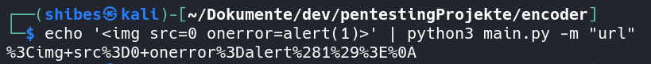

# Encoder

Welcome to 'Encoder'!
A simple tool for encoding strings into the specified format.

At the moment there are three encoding schemas implemented.

* base64 Encoding -> -m 'base64'

* HTML Entitiy Encoding -> -m 'html'

* URL Encoding -> -m 'url'

## Quickstart

